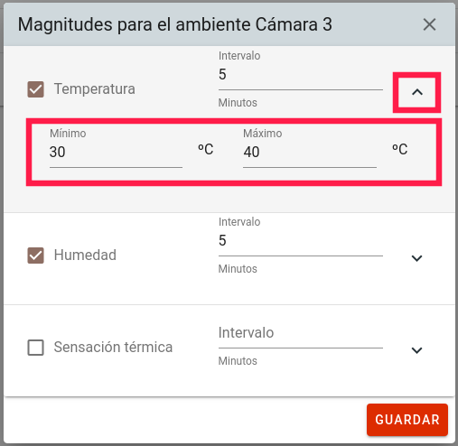

# MANUAL DE USUARIO DE MONITOREO DE CÁMARAS DE MADURACIÓN

## INGRESO AL SISTEMA

Este sistema es compatible con los navegadores Firefox y Chrome.
La dirección provista por el personal de sistemas es: [http://192.168.1.78](192.168.1.78)

En esta pantalla se deben ingresar las credenciales en los campos de usuario y contraseña, mismas que serán provistas por el personal a cargo de la administración del sistema.

## COMPONENTES DEL SISTEMA

El sistema se compone de 3 partes:

1. Menú principal para navegar entre los módulos de Reportes, Parámetros y Usuarios.
2. Monitoreo de los sensores en tiempo real.
3. Datos de usuario actual.

## MONITOREO EN TIEMPO REAL

### MONITOREO DE TEMPERATURA

En esta sección se observan los valores actuales de temperatura de cada cámara de maduración y la hora en que dicho dato fue recibido.

### MONITOREO DE HUMEDAD

En esta sección se observa un histórico de los últimos diez valores de humedad de cada cámara de maduración, el valor actual y la hora en que dicho dato fue recibido.

### MONITOREO DE SENSACIÓN TÉRMICA

En esta sección se observa un histórico de los últimos diez valores de sensación térmica de cada cámara de maduración, el valor actual y la hora en que dicho dato fue recibido.

### MONITOREO DE DISPOSITIVOS

En esta sección se observa el estado de la conexión del dispositivo que captura los datos de los sensores instalados en las tres cámaras de maduración.

## REPORTE HISTÓRICO DE DATOS

En este módulo se visualizan los datos capturados para cada magnitud de cada cámara de maduración de acuerdo a un rango de fechas, indicando el valor medido por el sensor, la fecha y la hora en la cual se obtuvo la medición.

Para obtener un listado de los datos capturados se siguen los pasos a continuación:

1. Seleccionar una cámara de maduración.

2. Seleccionar una magnitud.

3. Seleccionar un rango de fechas.

Con ello se mostrarán los valores capturados en el rango de fechas seleccionado.

En caso de existir datos en este rango se habilitará el botón de descarga del reporte Excel.

Al hacer clic en este botón se descargara un archivo con el nombre de la cámara seguido del rango de fechas seleccionado.

Este archivo contiene una los valores de cada magnitud en un rango de fechas ordenado de manera ascendente y ubicado en una hoja diferente para cada magnitud.

## GESTIÓN DE AMBIENTES

En este módulo se visualizan las cámaras de maduración registradas.

Se tienen dos opciones para cada cámara registrada, edición de datos de la cámara y edición de parámetros de captura y límites de cada magnitud.

### LISTADO DE AMBIENTES

### EDICIÓN DE DATOS DE UNA CÁMARA

Para cambiar el nombre con el que se visualizarán los datos de una cámara se debe seleccionar el botón de *lápiz* azul ubicado en la columna de **Acciones**

Esta acción abrirá una ventana de diálogo donde se puede observar cual es el dispositivo que captura los datos de la cámara y se puede cambiar el nombre de la misma.

### EDICIÓN DE PARÁMETROS DE CAPTURA

Para activar la captura de datos de una magnitud para cada cámara, cambiar el intervalo con el que se capturan los datos y los límites para el sistema de control visual, se debe seleccionar el botón de *gota* anaranjado ubicado en la columna de **Acciones**

Esta acción abrirá una ventana de diálogo donde se puede activar o desactivar la captura de datos de una o más magnitudes para cada cámara por separado.

También se puede definir el intervalo de tiempo (en minutos) en el cual los datos serán almacenados en la base de datos, dichos valores serán recuperados en los reportes como se mostró anteriormente.

Para definir los límites inferior y superior se debe seleccionar una magnitud con la flecha inferior a la derecha que abrirá el formulario de edición de límites.

Una vez editados los valores se debe **GUARDAR** el formulario mediante el botón correspondiente.

Los cambios se aplican instantáneamente en el dispositivo, por lo cual después de guardar los límites los colores de la pantalla del monitor en tiempo real serán idénticos a los colores de los LEDs del dispositivo instalado en las cámaras de maduración.

## GESTIÓN DE USUARIOS

### AÑADIR USUARIO

Para agregar usuarios al sistema se debe hacer click en el botón *Más*

Se debe llenar el formulario y presionar el botón **Guardar**.

Ahora se debe seleccionar uno de los dos roles:

* RESPONSABLE: Puede cambiar parámetros del sistema como se mencionó anteriormente, además de gestionar usuarios y roles de usuario, restablecer contraseñas de usuarios y realizar las acciones del rol MONITOR que se mencionan a continuación.
* MONITOR: Sólo puede monitorear la captura de datos en tiempo real y descargar reportes históricos.

### RESTABLECER CONTRASEÑA DE USUARIO

Para restablecer la contraseña de cualquier usuario en caso de olvido basta con hacer click en el botón de *llave* rojo que se encuentra en la columna de ACCIONES del listado de usuarios.

Con ello el usuario restablecido podrá ingresar al sistema con la contraseña por defecto, que es el mismo nombre de usuario que se muestra en el listado.

### EDICIÓN DE DATOS DE USUARIO

Para editar los datos de un usuario se debe hacer click en el botón *lápiz* azul ubicado en la columna ACCIONES del listado de usuarios.

Se debe modificar el formulario de acuerdo a los datos deseados y presionar el botón **Guardar**.

En este formulario se puede desactivar a un usuario, al cambiar de estado *ACTIVO* a *INACTIVO* el usuario desactivado ya no podrá ingresar al sistema.

Los usuarios desactivados se pueden ubicar en la pestaña de **INACTIVOS**.

Para volver a activar un usuario se debe hacer click en el botón *lápiz* azul ubicado en la columna ACCIONES del listado de usuarios. Luego cambiar el switch del estado *INACTIVO* a *ACTIVO* y **GUARDAR**.

Con esto el usuario volverá a la pestaña de *ACTIVOS* del listado de usuarios.

### ASIGNACIÓN DE ROL

Para asignar o cambiar el rol de un usuario, se debe hacer click en el botón *escudo* anaranjado de la columna de ACCIONES del listado de usuarios.

Ahora se debe asignar uno de los dos roles mencionados anteriormente y presionar el botón **GUARDAR**.

## PERFIL DE USUARIO

El perfil de usuario permite cambiar la contraseña del usuario autenticado. Para ello se debe hacer click en botón con las iniciales del usuario actual en la parte superior derecha de la pantalla.

En esta vista se puede cambiar la contraseña presionando el respectivo botón.

Se debe llenar el formulario con la contraseña actual y repetir la contraseña nueva dos veces. El sistema informará de un error en caso de que la contraseña actual no sea la correcta o que los campos de contraseña nueva no coincidan.

En caso de no existir errores en el formulario, el sistema cerrará la sesión y se deberá ingresar con la nueva contraseña.

## CERRAR SESIÓN

Para salir de la sesión actual bastará con hacer click en la opción *CERRAR SESIÓN* del menú superior derecho.

## RECOMENDACIONES

* La primera acción de un nuevo usuario debe ser el cambio de contraseña para evitar el uso indebido de la nueva cuenta.
* Se debe cerrar la sesión cuando no se vaya a hacer uso del sistema.
* Se deben desactivar los usuarios que ya no podrán ingresar al sistema lo antes posible para evitar errores por uso indebido.